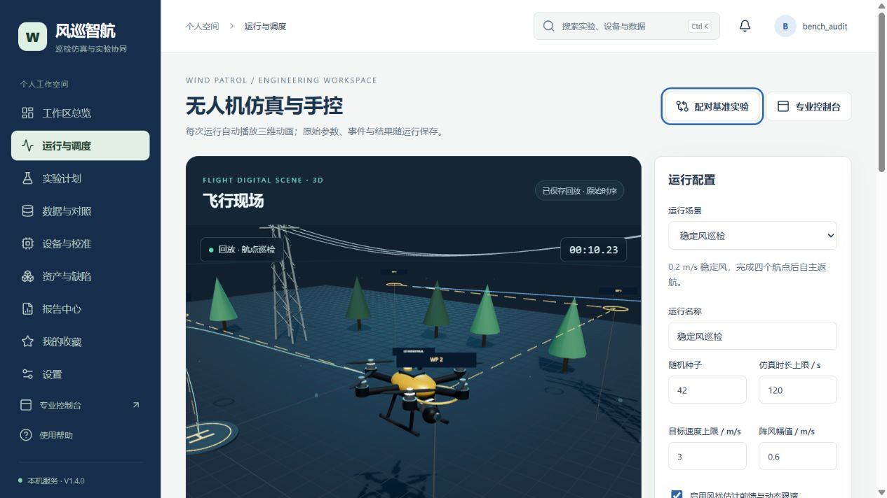
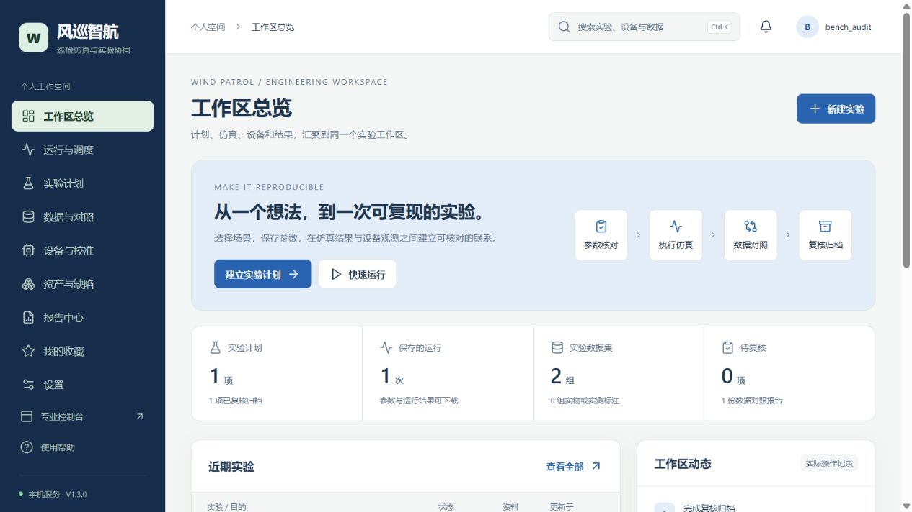

# V1.4：三维仿真与手控

每次自动仿真播放对应的无人机或传送带动画，可手控、切换机型/任务、全屏、历史回放和导出动画。运行、输入轴和原始结果在个人账户中保存。

[三维与手控实操](docs/V1.4三维与手控实操.md) · [遥控器及机型范围](docs/遥控器及机型适配范围.md) · [本次维护说明](docs/V1.4版本说明.md)



# V1.3：个人实验工作区

默认首页现已串联实验计划、真实仿真、设备观测、数据对照和复核归档。

[工作区实操步骤](docs/V1.3工作区实操.md) · [维护说明](docs/V1.3版本说明.md)



## V1.2：仿真与实测实验中心

启动服务后打开 `/lab.html`，导入已有运行、CSV日志，查看曲线与误差报告。

[使用步骤与实物接入路线](docs/仿真与实物结合升级说明.md)

# 风巡智航 · 多风环境无人机巡检系统

维护版1.1.1：Python仿真、账户注册与登录、个人任务库、资产缺陷流转和配对实验。

## 运行

```text
python -m pip install -r requirements.txt
python app.py
```

打开提示地址，注册后使用。完整步骤见 docs/多用户使用与部署说明.md。旧的单用户数据库保留在原目录，可在停服后导入指定空账户。在线使用需要Python后端和持久磁盘。Docker及Render配置已准备。

```text
python manage.py test portal
python 账户实际验收.py
```

测试采用独立数据目录，不写入已有任务库。源码使用MIT许可；原始申请材料和真实用户数据不包含在源码发布包。仿真用于算法与流程验证，真实飞机测试应另记录。
